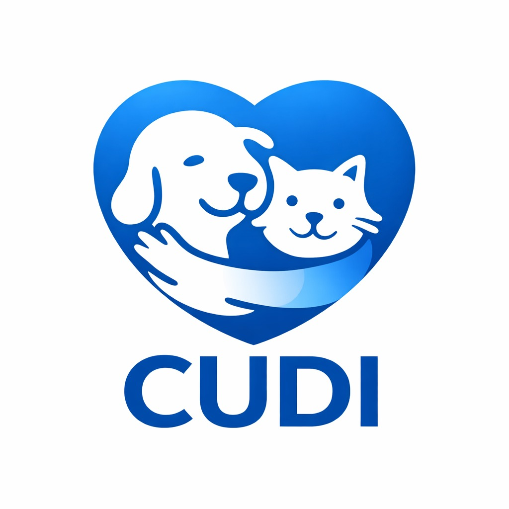

# CUDI - Ecosistema Integral de Bienestar Animal

**CUDI** es una plataforma tecnológica de vanguardia diseñada para transformar la salud de las mascotas mediante inteligencia artificial, telemetría y servicios premium integrados.

## 🚀 Características Principales

- **Smart Collar CUDI**: Geolocalización GPS en tiempo real y telemetría de signos vitales.
- **IA de Triaje 24/7**: Asistente inteligente capaz de detectar anomalías y sugerir protocolos de urgencia.
- **Marketplace Premium**: Acceso a nutrición orgánica, seguros veterinarios y servicios de bienestar certificados.
- **Gemelo Digital**: Monitorización continua de la actividad física y el descanso.

## 📁 Estructura del Proyecto

- `index.html`: Lanzadera principal y portal de servicios.
- `simulador-gemelo-digital-telemetria.html`: Aplicación interactiva de telemetría móvil.
- `campana-lanzamiento.html`: Landing page optimizada para conversión del Smart Collar.
- `styles.css`: Motor gráfico basado en Glassmorphism y diseño premium.
- `script.js`: Cerebro funcional de la IA, el buscador global y el carrito unificado.

## 🌐 Despliegue

Este proyecto está configurado para ser desplegado en **GitHub Pages**.

### Instrucciones de Instalación Local
1. Clona este repositorio.
2. Abre `index.html` en tu navegador preferido.

---
**Desarrollo realizado por Sergio Alejandro Ospina Rocha © 2026**
